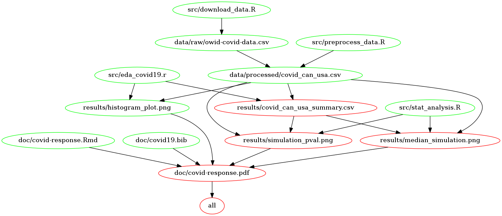

# About

The data set used in this project comes from the Our World in Data COVID-19 Database created by Max Roser et al. [@owidcoronavirus]. This data set examines the impact of COVID-19 on countries all over the world, where daily statistics pertaining to the pandemic from over 200 countries have been recorded each day since December 31st 2019. Each row in the data set represents a date in a country, where measurements like total cases, new daily cases, hospital admission rates etc. are recorded. Data has been collected in conjunction with the World Health Organization (WHO), the European Center for Disease Prevention and Control (ECDC) and is available on [Our World in Data](https://ourworldindata.org/coronavirus) and raw data can be found [here](https://raw.githubusercontent.com/owid/covid-19-data/master/public/data/owid-covid-data.csv).

With this data, we ask whether there is a difference in the ratio of the new daily tests performed to the new daily cases between Canada and the United States. Since the distributions were found to be left skewed and of unequal variance (see EDA [here](https://github.com/UBC-MDS/covid-19-cases-vs-tests-analysis/tree/0.1.0/eda)), we performed a two-tailed hypothesis test checking for the independence of medians using permutation. With a significance level of 0.05, we found that there was enough evidence to conclude that the median response ratio was significantly different between Canada and the United States (p-value \< 0.0001). This is one way to begin to assess the different responses and outcomes that these two countries have faced during the pandemic. However, further analysis is required to better understand the differences present in the Canada-US responses to COVID-19.

# Report

The final report can be found [here](https://github.com/UBC-MDS/covid-19-cases-vs-tests-analysis/blob/main/doc/covid-response.pdf).

# Usage

There are two suggested ways to run this analysis:

### 1. Using Docker

*note - the instructions in this section also depends on running this in a unix shell (e.g., terminal or Git Bash)*

To replicate the analysis, install [Docker](https://www.docker.com/get-started). Then clone this GitHub repository and run the following command at the command line/terminal from the root directory of this project:

    docker run --rm -v /$(pwd):/home/rstudio/covid-19-cases-vs-tests-analysis fatse/covid19-cases-vs-tests:v0.8.0 make -C /home/rstudio/covid-19-cases-vs-tests-analysis all

To reset the repo to a clean state, with no intermediate or results files, run the following command at the command line/terminal from the root directory of this project:

    docker run --rm -v /$(pwd):/home/rstudio/covid-19-cases-vs-tests-analysis fatse/covid19-cases-vs-tests:v0.8.0 make -C /home/rstudio/covid-19-cases-vs-tests-analysis clean

### 2. Without using Docker

To replicate the analysis, clone this GitHub repository, install the [dependencies](#dependencies) listed below, and run the following commands at the command line/terminal from the root directory of this project:

    make all 

To reset the repo to a clean state, with no intermediate or results files, run the following command at the command line/terminal from the root directory of this project:

    make clean

#### Dependency Diagram of the Makefile

# Dependencies

-   Python 3.8.5 and Python packages:

    -   docopt==0.6.2
    -   pandas==1.1.4
    -   numpy
    -   altair
    -   altair\_saver
    -   selenium
    -   chromedriver\_binary

-   R version 3.6.1 and R packages:

    -   knitr==1.29
    -   readr==1.3.1
    -   tidyverse==1.3.0
    -   docopt
    -   broom==0.7.1
    -   infer==0.5.3
    -   cowplot==1.1.0
    -   ggplot2
    -   kableExtra
    -   webshot
    -   magick
    -   ggthemes

-   GNU make 4.2.1

# License

The materials on analysis about Covid-19 mean response ratio for Canada and USA are licensed under the MIT License (Copyright (c) 2020 Master of Data Science at the University of British Columbia). If you want to re-use/re-mix the analysis and the materials used in this project, please provide attribution and link to this repository.

# References
