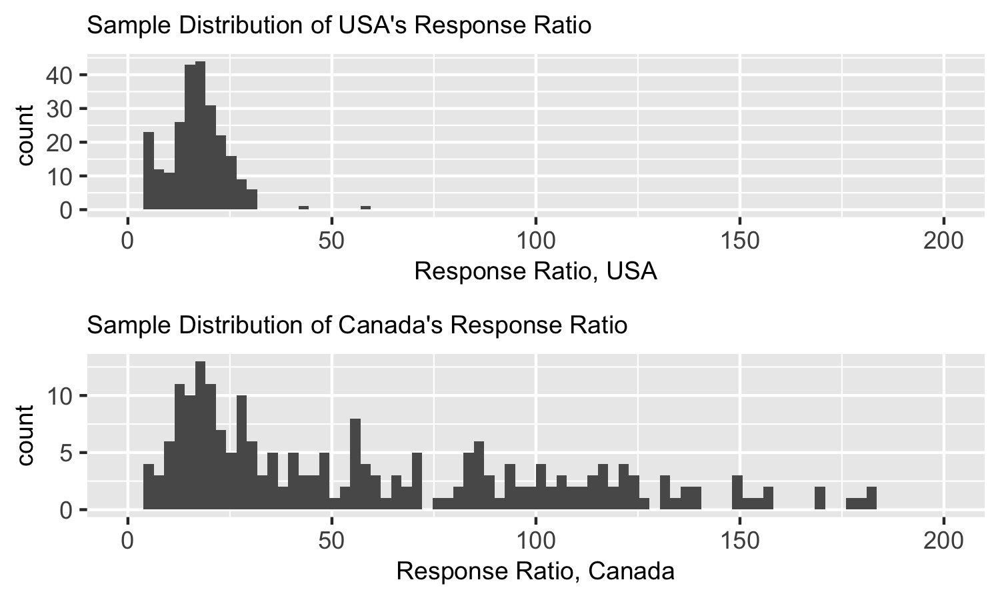
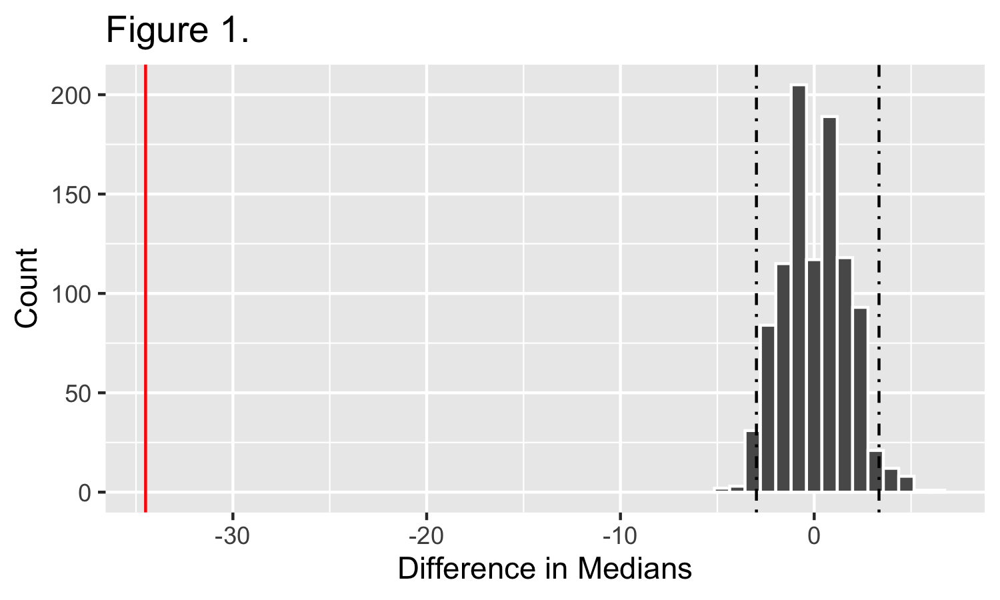

```{r setup, include=FALSE}
knitr::opts_chunk$set(echo = FALSE)
library(knitr)
library(tidyverse)
```

# Aim

This project explores if there is a quantifiable difference in the Covid-19 responses of Canada and USA as measured through analyzing the number of daily new cases and daily new tests being conducted in both the countries between March and October 2020.

# Introduction

Coronavirus disease 2019 (COVID-19) is a contagious disease caused by the severe acute respiratory syndrome coronavirus 2 (SARS-CoV-2) [@who]. North-America has been severely impacted by COVID-19; a quarter of all global deaths as of November 27th, 2020 have occurred on the continent. Observing the pandemic's impact at a country level shows a stark contrast in the number of cases and deaths between Canada as USA. As of November 27th, 2020, there have been 241,906 deaths in the US and 11,799 deaths in Canada as per the countries' official sources [@cdc, @govCA]. Even if we account for some factors such as population densities, number of international airports, migration of people, climatic factors, etc. to understand the varied impact of COVID-19 on Canada and USA it still seems worthwhile to explore how the response measures of both the countries have shaped the pandemic's trajectory since it first broke out on the continent in January 2020 [@first-case]. Moreover, the widespread coverage and analysis of the COVID-19 in global media as well as different studies in the academic community have led to a popular perception that Canada has been able to better respond to the pandemic than USA. For instance, a study by Jeffrey Lazarus et al.[@covid-score] devised a `covid-score` metric to quantify the government response measures for different countries and ranked Canada (score = 61.00) much better than the USA (covid-score = 50.57). This project attempts a preliminary analysis of the COVID-19 data regarding daily cases and tests being conducted in Canada and USA to understand the response of the these two neighbors to one of the deadliest pandemics that the world has seen in decades.

# Project Scope

Epidemiology is a complex science and there are a myriad factors that can shape the course of a pandemic or determine how fatal its impact would be across a given population and timeframe. Modeling global pandemics and quantifying effectiveness of response measures is an even more challenging task as conspicuously observed throughout 2020 during the different phases of COVID-19 [@epidemiology]. This project is a first step towards trying to analyze the efficacy of Canadian and American responses towards COVID-19. The authors of this project(hereafter referred to as `the team`) have deliberately restricted the scope of the analysis to a simple statistical question and focused on building a well-rounded project-flow instead through the incorporation of some of the best practices for data science. The team has drawn inspiration from the principles and adages elucidated upon in Dr.Peng's quintessential work, `The Art of Data Science`[@aods].   

# Analysis

## The Question

We've defined response ratio to be the ratio of the daily new COVID-19 viral detection tests conducted to the daily new COVID-19 confirmed cases.

$$ \texttt{Response Ratio} = \frac{\text{Daily New COVID-19 Viral Detection Tests Conducted Nationally}}{\text{Daily New COVID-19 Confirmed Cases Nationally}} $$

The statistical question being probed in this project is, `Is there a difference in the median daily response ratio of Canada and USA between March 1st 2020 and October 31st 2020?`

The team feels that the question presents an opportunity to meaningfully explore COVID-19 data through a simple statistical analysis and stays true to the project scope as discussed in the section above. The question provides a stepping stone towards helping develop a prefatory understanding of COVID-19 responses in Canada and USA and can be built upon further through more robust analyses. The team acknowledges that there are several assumptions and limitations associated with this analysis and they are discussed in the relevant sections below. 

## Data

The data set used in this project comes from the `Our World in Data COVID-19` database created by Hannah Richie et al. [@owidcoronavirus]. This data set examines the impact of COVID-19 on countries all over the world; the data set comprises daily statistics pertaining to the pandemic from over 200 countries recorded since December 31st 2019. Each row in the data set represents a date in a country, where measurements like total cases, new daily cases, hospital admission rates etc. are recorded. Data has been collected in conjunction with the World Health Organization (WHO), the European Center for Disease Prevention and Control (ECDC) and is available on [Our World in Data](https://ourworldindata.org/coronavirus) and raw data can be found [here](https://raw.githubusercontent.com/owid/covid-19-data/master/public/data/owid-covid-data.csv).

## Assumptions and limitations

1. We've restricted the time-line for consideration to be between March 1st 2020 and October 31st 2020.
2. The choice of timeline is further explained in our Exploratory Data Analysis reports under the eda folder.
3. We acknowledge that it is impossible to gather data regarding the true population of confirmed COVID-19 cases and the viral detection tests being conducted.
4. Our sample sizes for both Canada and USA while calculating daily response ratios are limited by the data as present in our data set. 
5. We acknowledge that the nature of our data set is temporal and that there will be autocorrelation within each country's response rate calculations.
6. Our analysis seeks to establish a simple comparison with no attempts to infer causality and/or other overarching conclusions about either 

## Methodology

The team performed extensive EDA to wrangle the data and make it suitable for further analysis. Details of the EDA process are captured in our reports under the eda folder which can be found [here](https://github.com/UBC-MDS/covid-19-cases-vs-tests-analysis/tree/main/eda).

Firstly, we calculated the daily response ratio for both Canada and USA for the time-line of interest using the daily new_tests and new_cases columns found in the data set. We analyzed the distribution of the daily response ratio for both the countries during the time-line of interest as shown in the figure below.


Figure 1. Sample Distribution of Daily Response Ratio for USA and Canada between March 1st 2020 and October 31st 2020.

We analyzed and confirmed that there is a difference in the variances of distributions of the daily response ratio data for both Canada and USA during the time-line of interest through a Bartlett's test. 

The team decided to use permutation based hypothesis testing to answer our statistical question. We chose a 95% confidence level for our sample estimate i.e a significance threshold level of $ \alpha = 0.05 $ .

Our Null($H_0$) and Alternate($H_a$) Hypothesis are:

$ H_0: The median daily response ratio of Canada and USA between March 1st 2020 and October 31st 2020 is equal $
$ H_a: The median daily response ratio of Canada and USA between March 1st 2020 and October 31st 2020 is not equal $

We generated a bootstrap distribution of bootstrap sample median response ratios for Canada and USA during the time-line of interest. We visualized our booststrap distributions as shown in the figure below.


Figure 2. Bootstrap Distribution of the Difference in Median Daily Response Ratios for USA and Canada between March 1st 2020 and October 31st 2020.

Thereafter, we calculated the p-value for our hypothesis test. The results are discussed in the section below.

The R [@R] and Python [@Python] programming languages were used to perform the analysis in this project. The following R and Python packages were used: knitr [@knitr] and tidyverse [@tidyverse]. All the code used in the analysis can be found at <https://github.com/UBC-MDS/covid-19-cases-vs-tests-analysis/tree/main/src>. 


# Results and Discussion

The p-value for our test was <0.0001. Based on this p-value, since it is much lower than our significance threshold of 0.05 we reject our Null Hypothesis that the median daily response ratio of Canada and USA between March 1st 2020 and October 31st 2020 is equal. 

Our results are summarized in the table below.


Table 1. Results Summary.

Based on our analysis we can-not categorically say that Canada's overall response strategy towards COVID-19 was more efficient that that of USA; however, we can infer with reasonable confidence that the median daily response ratio as defined within the confines of our earlier stated assumptions was higher for Canada than USA between March 1st 2020 and October 31st 2020.

We also acknowledge that there are some pitfalls such as selection-bias, random-variability, and sampling-variability [@aods] which our analysis doesn't address owing to the scope of the project as explained earlier.

# Future Work

Our analysis can be be built upon further to devise a more sophisticated framework to understand COVID-19 responses in Canada and USA. Some of the interesting points which would help expand the scope of this project include:
- Include more robust data, for e.g. finding data for some of the missing days in the current data set.
- Expand the time-line of consideration for the analysis.
- Address the auto-correlation caused by the temporal nature of the daily data points by using appropriate time-series analysis techniques. 
- Explore more features to include in quantifying the `Response Ratio`.
- Build a model to take into account the other relevant features as discovered in the point above.


# References
